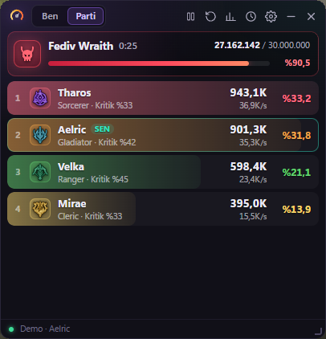
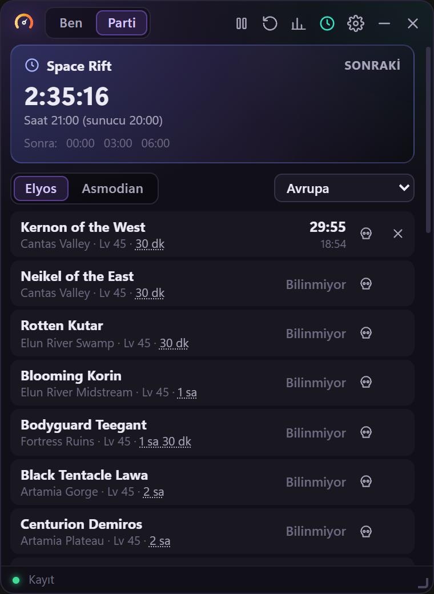
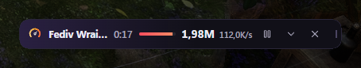
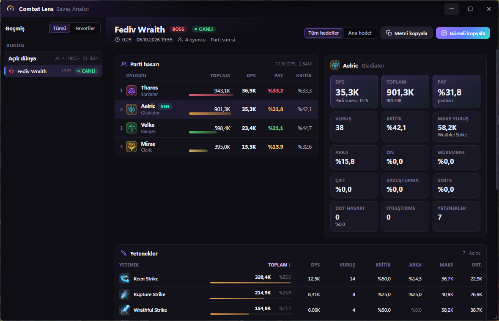

# Combat Lens — AION 2 DPS Meter

**[Türkçe](#türkçe) · [English](#english)**

<p> </p>
<p></p>



<sub>Görseller `--demo` modundan, oyuncu isimleri uydurmadır.</sub>

---

## Türkçe

Senin ve parti üyelerinin DPS'ini oyunun üstünde gösteren, her savaşı **skill skill** (oyunun kendi ikonları ve isimleriyle) inceleyebildiğin bir DPS meter. AION 2 Global / Steam için.

Oyuna dokunmaz. Bilgisayarına gelen ağ paketlerini Npcap ile **sadece okur**: oyuna bir şey göndermez, oyunun dosyalarına ya da belleğine dokunmaz.

### Özellikler

- **Oyunun üstünde şeffaf panel**: sınıf renkli satırlar, sınıf amblemleri, boss can çubuğu, **Ben / Parti** sekmeleri.
- **Her boss bitince kendiliğinden sıfırlanır.** Biten savaş geçmişe kaydedilir ve panelde 5 dakika kalır (ayarlardan 1–10 dk, ya da bir sonraki savaşa kadar).
- **Boss ve Rift sayaçları** (🕒): 48 field boss'un çıkma geri sayımı ve sıradaki Space Rift portalı.
  - Yanında ölen field boss'u meter kendisi görür ve sayacı başlatır. Görmediklerini kurukafa ile işaretlersin.
  - Süreleri istersen boss boss değiştirebilirsin.
  - Rift saatleri sunucu bölgesine göre (Avrupa, Kuzey Amerika, Japonya, Kore, Tayvan) senin saatine çevrilir. Rift 10 dakika içinde açılacaksa panelde uyarı çıkar.
- **Savaş analizi penceresi**:
  - Geçmiş listesi bölgeye ve güne göre gruplanır, savaşları favorilere ekleyebilirsin.
  - Parti tablosu ve oyuncu özeti: DPS, toplam, pay, kritik, arka, ön, mükemmel, çift, savuşturma, smite, en büyük vuruş, DoT, iyileştirme.
  - Sıralanabilir skill tablosu.
  - Oyuncu oyuncu **DPS eğrisi**.
  - Hedefler ve iyileştirme dökümü.
- **Paylaş**: sonucu Discord'a yapıştırmak için **görsel** ya da hizalı **metin** olarak panoya kopyalar.
- **Şerit modu** (–): panel tek ince satıra iner. Satırda süre, boss canı ve DPS görünür.
- **Tıklama geçirgen mod**: panel görünür kalır, tıklamalar oyuna geçer.
- **Genel kısayollar** (oyun öndeyken de çalışır):

  | Kısayol | İşlev |
  |---|---|
  | `Ctrl+Shift+R` | Sıfırla (yeni savaş) |
  | `Ctrl+Shift+P` | Durdur / başlat |
  | `Ctrl+Shift+M` | Şerit / tam panel |
  | `Ctrl+Shift+H` | Gizle / göster |
  | `Ctrl+Shift+T` | Tıklama geçirgen aç / kapat |
  | `Ctrl+Shift+D` | Analiz penceresi |

- **Türkçe / English** arayüz. Panelin saydamlığı ayarlanabilir.
- Npcap yoksa ilk açılışta indirme bağlantısını gösterir.
- **Kendini günceller:** yeni sürüm çıkınca panelin altında "Güncelle" belirir. Tıklayınca indirir, doğrular, kurar ve yeniden açılır; ayarlar ve geçmiş olduğu gibi kalır.

### Kurulum

1. [Npcap](https://npcap.com/#download)'i kur. Kurulumda **"WinPcap API-compatible Mode"** işaretli kalsın. Npcap'in lisansı uygulamayla birlikte dağıtılmasına izin vermiyor, bu yüzden ayrı kurulur.
2. [Releases](https://github.com/furkansocials-hue/combat-lens/releases/latest) sayfasından **`CombatLens.exe`**'yi indir ve çift tıkla, kurulum yok. Windows SmartScreen uyarı verirse "Ek bilgi" → "Yine de çalıştır". (Aynı yerdeki `CombatLens-x.y.z.zip` klasörlü hali: biraz daha hızlı açılır.)
   Kaynak koddan çalıştırmak için `BASLAT.bat`'a çift tıkla (Python 3.10+, `pip install pywebview`).
3. Oyunu **Pencereli** ya da **Kenarlıksız pencere** modunda oyna. Tam ekran modunda panel oyunun arkasında kalır.

Oyun açıkken birkaç saniye içinde paneldeki nokta yeşile döner ("Bağlı").

**İlk kullanımda:** meter açıkken bir kez teleport ol ya da bölge değiştir; oyun karakterinin adını sadece yükleme ekranında gönderiyor. Sonra hep hatırlanır.

### Kullanım

| | |
|---|---|
| **Ben / Parti** | Sadece sen, ya da partin (partide değilsen etrafta vuran herkes) |
| ⏸ | Saymayı durdurur. Çalışan savaş o haliyle geçmişe alınır |
| ↺ | Sıfırla: panel sıfırdan başlar. Biten savaşlar Analiz'de kayıtlı kalır |
| 📊 | Savaş analizi penceresi. Bir oyuncu satırına tıklamak da açar |
| 🕒 | Boss ve Rift sayaçları. Elyos / Asmodian ve sunucu bölgesi buradan seçilir |
| ⚙ | Dil, saydamlık, sayım modu (tüm hedefler / ana hedef), savaş bitince temizleme süresi, tıklama geçirgen, kısayollar, oyun verisini güncelle |
| – | Şerit modu. Alt kenar sabit kalır: panel yukarı doğru açılır, şeride aşağı iner. Şeride çift tıklamak ya da ⌄ geri açar |
| ‹ 3/7 › | Önceki savaşlar |
| Sağ alt köşe | Boyutlandır. Üst boşluktan sürükleyerek taşınır |

Ayarlar, geçmiş savaşlar, öğrenilen oyuncu isimleri, ikon önbelleği ve kayıtlar `%APPDATA%\CombatLens\` altında durur.

### Rakamlar nasıl hesaplanıyor

- **DPS** = toplam hasar ÷ süre.
  - Partideyken herkes için ortak savaş süresi kullanılır: partinin ilk vuruşundan son vuruşuna.
  - Partide değilken herkes **kendi** ilk vuruşundan son vuruşuna kadar ölçülür.
- **DoT tikleri** son direkt vuruştan sonra da sayılır. Oyunun kendi **Combat Analysis** penceresi de böyle sayar.
- **Oyunla karşılaştırma** (Training Scarecrow, 186 vuruş): her skill'in hasarı, vuruş sayısı ve kritik / mükemmel / çift / arka oranları oyunun Combat Analysis'iyle birebir aynı çıktı.
- **Bir savaş biter**:
  - boss ölünce (sunucu boss'un HP'sini 0 gösterdiği an),
  - 20 saniye hasar gelmezse,
  - bölge değişince,
  - trash'ten sonra boss'a girilince,
  - bir bosstan sonra başka bir boss'a vurulunca (iki boss aynı anda dövülüyorsa tek savaş sayılır).
- **Boss** iki yoldan tanınır: NPC tablosunda boss olarak işaretliyse (1.412 NPC; dungeon bossları ve 48 field boss'un hepsi dahil), ya da HP'si bölgedeki sıradan mob'ların en az 40 katı ve 1 milyondan fazlaysa.
- **Pet / summon / aura** hasarları sahibine eklenir. Oyuncudan oyuncuya giden heal ve buff'lar hasar sayılmaz. TCP tekrar gönderimleri ayıklanır.
- **İyileştirme**: oyuncunun kendine ve partiye yaptığı heal, HoT ve can çalma.
- **Alınan hasar** gösterilmiyor. Oyun bu bilgiyi okunan hasar kayıtlarıyla göndermiyor.

### Doğruluk

Sunucu her vuruştan sonra mob'un kalan HP'sini gönderiyor. Meter'ın okuduğu hasar bu HP düşüşüyle karşılaştırıldı:

| Hedef | HP | Meter'ın okuduğu | |
|---|---|---|---|
| Tiere (boss) | 5.220.000 | 5.234.807 | %100,3 (fark son vuruştaki fazla hasar) |
| Thamon (boss) | 5.220.000 | 5.527.077 | %105,9 (boss savaşta 237.194 HP iyileşiyor) |
| Enraged Earth Spirit | 232.000 | 234.973 | %101,3 |

Kendi kaydında da aynı testi yapabilirsin: `python tools\validate_hp.py kayitlar\DOSYA.txt`

### "Sen" ve parti nasıl tanınıyor

- **Sen**:
  - Oyun karakter kaydını bölge yüklemesinde gönderir; meter seni oradan tanır.
  - Meter'ı oyunun ortasında açtıysan, vurmaya başladıktan yaklaşık 1 saniye sonra sadece yerel oyuncuya gelen HP kaydından seni bulur.
  - Adın ise sadece bir yükleme ekranında gelir. İlk kullanımda `#numara` görünürse meter açıkken bir kez teleport ol ya da bölge değiştir. Adın kaydedilir, sonraki açılışlarda hemen görünür.
- **Partideyken**:
  - Oyun parti listesini sadece bir şey değiştiğinde gönderir.
  - Liste gelmediyse meter partiyi **parti haritası işaretlerinden** anlar. Her işaretin kime ait olduğunu, işaretle oyuncunun hareket paketindeki konumu eşleştirerek bulur.
- **Hesap defteri**:
  - Bir oyuncu görüş alanına girdiğinde oyun adıyla birlikte kalıcı hesap numarasını da gönderir. Meter bunları saklar.
  - Biriyle sonra partiye girersen adı defterden bulunur.
- **Partide değilken** Parti sekmesi etrafta vuran herkesi gösterir.
  - Yabancıların adını oyun sadece onlar görüş alanına girdiğinde gönderir.
  - Meter açılmadan önce yanında olanlar bir süre `#numara` olarak görünebilir.

### Kayıt ve tekrar oynatma

Rakamlar yanlış görünürse **`KAYITLI_BASLAT.bat`** ile aç. Oyun akışı `%APPDATA%\CombatLens\kayitlar\` klasörüne kaydedilir. Kaydı daha sonra yeniden açmak için:

```
python -m aion2meter --replay "%APPDATA%\CombatLens\kayitlar\DOSYA.txt"
```

Tekrar oynatılan kayıtlar geçmişine eklenmez.

Diğer seçenekler:

| Seçenek | İşlev |
|---|---|
| `--demo` | Sahte veriyle önizleme |
| `--console` | Pencere yerine konsol çıktısı |
| `--tk` | Klasik pencere |
| `--lang de` | Skill/NPC isim dili |
| `--update-data` | Skill/NPC tablolarını indir |

### Oyun güncellemesinden sonra

- Yeni skill'ler `Skill 12345678` diye görünürse: ⚙ → **Veriyi güncelle** (ya da `--update-data`).
- Oyun paket yapısını değiştirirse meter hasar göstermeyi bırakabilir. O zaman çözücünün (`aion2meter/protocol.py`) güncellenmesi gerekir.

### Exe oluşturma

```
.venv\Scripts\python -m pip install pywebview pyinstaller
.venv\Scripts\python tools\build_exe.py
```

`dist\CombatLens\CombatLens.exe` ve `dist\CombatLens-x.y.z.zip` çıkar. Tek dosyalık exe için: `tools\build_exe.py --onefile` (`dist\CombatLens.exe`).

### Risk

Pasif bir okuyucu olsa da NCSoft hiçbir DPS meter'ı onaylamıyor. Kullanım koşulları üçüncü parti programları NCSoft'un takdirine bırakıyor. Toplulukta yaygın kullanılıyorlar ama **hesap riski sana ait**.

---

## English

A DPS meter for AION 2 (Global / Steam).

- A see-through panel over the game shows you and your party.
- An analysis window breaks every fight down skill by skill, with the game's own icons and names.

It never touches the game: it only **reads** the network traffic arriving at your PC (through Npcap). It sends nothing to the game and does not read or change its memory or files.

**Features**

- Class-coloured live rows and a boss HP bar.
- **Me / Party** tabs.
- Resets by itself after every boss. Past fights are saved, grouped by zone and day, and can be starred.
- Field boss respawn timers (started by the meter when it sees a boss die) and the Spacetime Rift clock.
- Per-player summary: crit, back, front, perfect, double, parry, smite, max hit, DoT, healing.
- Sortable skill table, per-player DPS curve, targets and healing.
- Copy a result as an image or as aligned text for Discord.
- Strip mode and click-through mode.
- Global hotkeys (table above).
- Turkish / English UI.
- Npcap check on first run.
- One-click self-update from GitHub releases (download, checksum, restart).

**Install**

1. Install [Npcap](https://npcap.com/#download) with *WinPcap API-compatible Mode*. Its licence does not allow bundling it.
2. Download `CombatLens.exe` from [Releases](https://github.com/furkansocials-hue/combat-lens/releases/latest) and run it (the zip next to it is the same app as a folder).
3. Play in windowed or borderless mode.
4. On first use, teleport or change zone once with the meter open: the game sends your character name only on a loading screen. It is remembered after that.

**Accuracy**

- Damage read was checked against the server's own HP updates: 100.3% on the Tiere boss.
- Every skill's damage, hit count and tag rates matched the game's Combat Analysis exactly on a training dummy.
- Damage taken is not shown: the game does not send it in the records the meter reads.

**Risk**: NCSoft does not endorse any DPS meter. Third-party tools are at their discretion; use at your own risk.

## Lisans / Licence

GPL-3.0. Ayrıntılar ve üçüncü parti lisansları: [THIRD_PARTY_NOTICES.md](THIRD_PARTY_NOTICES.md).

- Paket çözümü [A2Tools DPS Meter](https://github.com/taengu/A2Tools-DPS-Meter) (GPL-3.0) projesinin tersine mühendislik çalışmasına dayanır. Skill/NPC tabloları da oradan gelir.
- Arayüz ikonlarının bir kısmı [Lucide](https://lucide.dev) (ISC) çizimlerine dayanır.
- Logo bu proje için çizildi. Sınıf amblemleri A2Tools DPS Meter projesinden alınmıştır; oyunun görselleridir ve NCSOFT'a aittir. Skill ikonları uygulamanın içinde gelmez; çalışırken oyunun kendi CDN'inden (`assets.playnccdn.com`) çekilip bilgisayarında önbelleğe alınır.
- Field boss süreleri [AION 2 Guides](https://couga54.github.io/aion2-guides/en/bosses/) (Global, 4 Ekim 2026), Rift takvimi [Aion2Timers](https://www.aion2timers.com/spacetime-rift-timer/) sayfasından alındı. Oyun güncellenirse değişebilir.
- AION ve AION 2, NCSOFT Corporation'ın ticari markalarıdır. Bu proje NCSOFT ile bağlantılı değildir, NCSOFT tarafından onaylanmamış ya da desteklenmemiştir.

The decoding builds on A2Tools DPS Meter (GPL-3.0); some UI icons are based on Lucide (ISC). The logo is original. The class emblems come from A2Tools DPS Meter and are NCSOFT game art; skill icons are fetched at run time from the game's CDN. AION and AION 2 are trademarks of NCSOFT Corporation; this project is not affiliated with or endorsed by NCSOFT.
